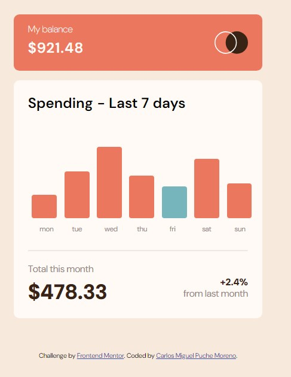

# Expenses Chart Component: Dynamic Data Visualization

> [!Note]
>> This repository contains a legacy project from my early days as a programmer

This project is a **historical practice** focused on data-driven UI components. It represents my first successful implementation of external data fetching to build a dynamic bar chart, emphasizing the synchronization between a JSON data source and a responsive CSS layout.

---

## 🚀 Demo
[SEE DEMO HERE](https://cmp2007.github.io/Expenses-chart-component/)

### 🏆 Challenge Context
This project was developed as a solution to the [Expenses chart component challenge on Frontend Mentor](https://www.frontendmentor.io/solutions/expenseschartcomponent-98jjWfjSms).

### Screenshot

---

## 📋 Evolution & Context Note
> ⚠️ **Note on my trajectory:** This repository showcases the transition from hard-coded values to dynamic content. By utilizing `fetch()` and `Object.values()`, I learned to transform raw data into visual proportions. This project serves as a foundation for my understanding of how modern web apps communicate with APIs and databases.

## 📋 Technical Milestones of this Stage
In this specific phase of my training, I successfully achieved:

* **Asynchronous Data Fetching:** Implementation of the `fetch()` API to retrieve and parse a local `data.json` file, effectively decoupling the information from the presentation layer.

* **Dynamic Chart Scaling:** Creation of a mathematical scaling logic that calculates bar heights in `rem` units, adjusted by a dynamic `divisor` based on screen size (`matchMedia`) to ensure visual consistency.
* **Date-Driven UI Logic:** Use of the JavaScript `Date()` object to automatically identify and highlight the current day with a distinct brand color (`cyan`), improving the user's contextual awareness.
* **Sophisticated Hover States:** Implementation of a "Tooltip" system using CSS `visibility` and the adjacent sibling selector (`+`) to display specific spending amounts only when interacting with the bars.
* **Flexbox Data Alignment:** Utilization of `flex-direction: column-reverse` within the chart containers to ensure the bars grow from the bottom up while maintaining a clean label alignment.

## 🛠️ Technologies (at the time)
* **HTML5:** Semantic structure for financial dashboards.
* **CSS3:** Flexbox for alignment, responsive scaling, and interactive hover effects.
* **Vanilla JavaScript:** `fetch` API, Promises, and real-time DOM styling based on JSON values.

---
**Coded by [Carlos Miguel Puche](https://github.com/CMP2007)**
